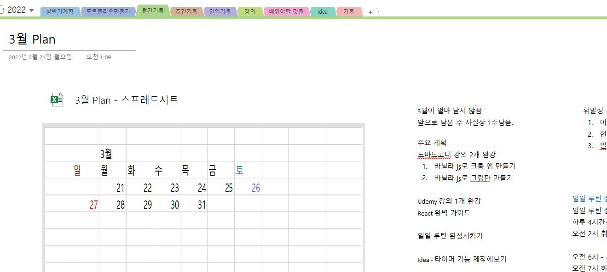

1. Udemy 강의 결제 총 3건 도합 들은 금액 51000 
   조금은 플렉스 해버렸을지도...
   열심히 공부해야지!!

2. 일일 루틴 작성 

일일 루틴 설정 

하루 4시간~6시간취침, 필요하다면 낮잠 1시간 

오전 2시 취침, 오전 6시 기상(+- 30min, 토요일은 휴식) 

오전 6시 - 세수, 담배, 운동(산책), 샤워 (1h) 
오전 7시 하루 시작 : 하루일과 체크, 기상시각 및 루틴 기록.(1h) 
오전 8시 아침식사(1h) 
오전 9시 학습시작 
노마드코더 학습(무료 강의 위주)
   
오후 1시 점심식사(1h) 
오후 2시 학습시작 
React 강의 학습 
   
오후 7시 저녁식사(1h) 
오후 8시 학습정리(30min) 

오후 8시 30분 자바스크립트 딥다이브 스터디 예습 시작 
오후 9시 -12시 오전12시 자바스크립트 딥다이브 스터디 
오후 12시- 1시 코테 스터디 혹은 정리

3. oneNote 계획표 작성
   
